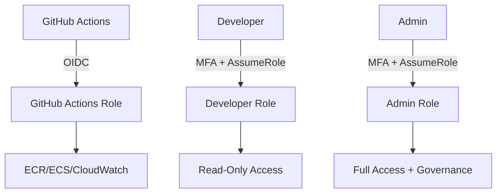

# AI Governance System for Raadi Marketplace

## 🤖 Overview

This document outlines the comprehensive AI Governance system implemented for the Raadi Marketplace, ensuring enterprise-level security, compliance, and operational excellence through automated policies and RBAC (Role-Based Access Control).

## 🎯 AI Governance Objectives

- **Security First**: Automated security scanning and vulnerability management
- **Compliance**: GDPR, ISO27001, and PCI-DSS compliance enforcement
- **Zero Trust**: Least privilege access with continuous validation
- **Auditability**: Complete audit trails for all operations
- **Automation**: AI-driven policy enforcement and remediation

## 🏗️ Architecture

### AI Governance Components

1. **Policy Engine**: Automated policy enforcement across all resources
2. **RBAC System**: Role-based access control with AWS IAM
3. **Security Scanner**: Multi-layer security scanning pipeline
4. **Compliance Monitor**: Continuous compliance validation
5. **Audit System**: Comprehensive logging and monitoring

## 🔐 RBAC (Role-Based Access Control)

### Roles Defined

#### 1. GitHub Actions Role (`raadi-marketplace-github-actions-role`)
- **Purpose**: Automated CI/CD operations
- **Access**: ECR, ECS, CloudWatch (resource-scoped)
- **Authentication**: OIDC (no long-term credentials)
- **Permissions**: Least privilege for deployment tasks

#### 2. Developer Role (`raadi-marketplace-developer-role`)
- **Purpose**: Development team access
- **Access**: Read-only access to production resources
- **Authentication**: Assume role with MFA required
- **Permissions**: Cannot modify production resources

#### 3. Admin Role (`raadi-marketplace-admin-role`)
- **Purpose**: Platform administration
- **Access**: Full access with governance constraints
- **Authentication**: Assume role with MFA required
- **Permissions**: Full access but requires approval for critical actions

### Access Patterns



## 🏷️ AI Governance Tagging Strategy

### Tag Categories

#### Core Governance Tags
```hcl
"ai:governance:version"     = "v1.0"
"ai:governance:policy"      = "raadi-enterprise-policy"
"ai:governance:compliance"  = "gdpr,iso27001,pci-dss"
"ai:governance:risk-level"  = "medium"
"ai:governance:criticality" = "high"
```

#### Resource Management Tags
```hcl
"ai:resource:auto-scale"    = "enabled"
"ai:resource:backup"        = "required"
"ai:resource:monitoring"    = "enhanced"
"ai:resource:lifecycle"     = "production"
```

#### Security Tags
```hcl
"ai:security:encryption"    = "required"
"ai:security:public-access" = "restricted"
"ai:security:data-class"    = "confidential"
"ai:security:network-tier"  = "private"
```

#### Cost & Optimization Tags
```hcl
"ai:cost:budget-alert"      = "enabled"
"ai:cost:optimization"      = "automated"
"ai:cost:owner"            = "platform-team"
"ai:cost:center"           = "marketplace"
```

#### Deployment Tags
```hcl
"ai:deployment:strategy"    = "blue-green"
"ai:deployment:approval"    = "required"
"ai:deployment:rollback"    = "automated"
"ai:deployment:canary"      = "enabled"
```

## 🛡️ Security Policies

### 1. Resource Creation Policies

#### Mandatory Tagging
- All resources MUST have `Project` and `ai:governance:version` tags
- Resources without governance tags are automatically denied

#### Encryption Requirements
- All storage resources MUST be encrypted
- All data in transit MUST use TLS 1.2+

#### Network Security
- No direct internet access to private resources
- All traffic through Application Load Balancer
- Security groups follow least privilege

### 2. Access Control Policies

#### Production Protection
- No direct production modifications by developers
- All production changes through CI/CD pipeline
- MFA required for all administrative access

#### Credential Management
- No long-term AWS credentials in GitHub
- OIDC-based authentication for all automation
- Regular credential rotation enforced

## 🔍 Compliance Framework

### GDPR Compliance
- **Data Protection**: All personal data encrypted at rest and in transit
- **Data Retention**: Automated cleanup policies for logs and data
- **Privacy by Design**: Default privacy settings in all configurations
- **Audit Trail**: Complete logging of all data access

### ISO27001 Compliance
- **Risk Management**: Automated risk assessment and mitigation
- **Access Control**: Role-based access with regular reviews
- **Incident Response**: Automated alerting and response procedures
- **Continuous Monitoring**: Real-time security monitoring

### PCI-DSS Compliance (Future)
- **Network Security**: Segmented networks for payment processing
- **Access Control**: Restricted access to cardholder data
- **Encryption**: Strong encryption for all payment data
- **Monitoring**: Enhanced logging for payment operations

## 🚀 CI/CD Pipeline with AI Governance

### Pipeline Stages

1. **AI Governance Validation**
   - Repository structure validation
   - Terraform configuration compliance
   - Security policy verification

2. **Enhanced Security Scanning**
   - Static Application Security Testing (SAST)
   - Dependency vulnerability scanning
   - Container security scanning
   - Infrastructure security validation

3. **Compliance Testing**
   - GDPR compliance checks
   - Logging pattern validation
   - Data handling verification

4. **Governance-Enhanced Testing**
   - Unit tests with coverage requirements (>80%)
   - Integration tests
   - Performance baseline validation

5. **Governed Deployment**
   - Infrastructure as Code deployment
   - Zero-downtime application deployment
   - Post-deployment validation
   - Audit log creation

### Security Gates

- **Critical Vulnerability Gate**: Fails build if critical vulnerabilities found
- **Test Coverage Gate**: Requires >80% test coverage
- **Compliance Gate**: Validates all compliance requirements
- **Performance Gate**: Ensures performance baselines are met

## 📊 Monitoring & Alerting

### AI-Driven Monitoring

1. **Security Monitoring**
   - Real-time threat detection
   - Anomaly detection for access patterns
   - Automated incident response

2. **Compliance Monitoring**
   - Continuous compliance validation
   - Policy drift detection
   - Automated remediation

3. **Performance Monitoring**
   - Application performance metrics
   - Infrastructure resource utilization
   - User experience monitoring

### Alert Categories

- **Critical**: Security incidents, compliance violations
- **Warning**: Performance degradation, resource limits
- **Info**: Deployment notifications, governance updates

## 🔧 Implementation Guide

### Setup RBAC

1. **Deploy Terraform Infrastructure**
   ```bash
   cd infrastructure/terraform
   terraform init
   terraform plan
   terraform apply
   ```

2. **Configure GitHub Secrets**
   ```
   AWS_ACCOUNT_ID: Your AWS Account ID
   ```

3. **Set up Role Assumptions**
   - Developers: Configure AWS CLI with MFA
   - Admins: Configure AWS CLI with MFA

### Using the System

#### For Developers
```bash
# Assume developer role
aws sts assume-role \
  --role-arn arn:aws:iam::ACCOUNT:role/raadi-marketplace-developer-role \
  --role-session-name developer-session \
  --external-id raadi-marketplace-developer

# View resources (read-only)
aws ecs describe-services --cluster raadi-marketplace-cluster
```

#### For Admins
```bash
# Assume admin role (MFA required)
aws sts assume-role \
  --role-arn arn:aws:iam::ACCOUNT:role/raadi-marketplace-admin-role \
  --role-session-name admin-session \
  --external-id raadi-marketplace-admin \
  --token-code MFA_TOKEN

# Perform administrative tasks
aws ecs update-service --cluster raadi-marketplace-cluster --service raadi-marketplace-service
```

#### For CI/CD
- GitHub Actions automatically uses OIDC to assume the GitHub Actions role
- No manual configuration required

## 📈 Governance Metrics

### Security Metrics
- Number of vulnerabilities detected and remediated
- Security policy compliance percentage
- Mean time to remediation (MTTR)

### Compliance Metrics
- Compliance score across frameworks
- Policy violations detected
- Audit findings and resolution time

### Operational Metrics
- Deployment frequency and success rate
- System availability and performance
- Cost optimization achievements

## 🔄 Continuous Improvement

### AI Learning Loop
1. **Monitor**: Collect metrics and feedback
2. **Analyze**: AI analysis of patterns and trends
3. **Optimize**: Automated policy adjustments
4. **Validate**: Test and verify improvements

### Regular Reviews
- **Weekly**: Security and compliance dashboard review
- **Monthly**: RBAC access review and cleanup
- **Quarterly**: Governance policy updates and improvements

## 📚 Resources

### Documentation
- [AWS IAM Best Practices](https://docs.aws.amazon.com/IAM/latest/UserGuide/best-practices.html)
- [Terraform AWS Provider](https://registry.terraform.io/providers/hashicorp/aws/latest/docs)
- [GitHub OIDC](https://docs.github.com/en/actions/deployment/security-hardening-your-deployments/about-security-hardening-with-openid-connect)

### Tools
- [Terraform](https://terraform.io) - Infrastructure as Code
- [AWS CLI](https://aws.amazon.com/cli/) - AWS Command Line Interface
- [GitHub Actions](https://github.com/features/actions) - CI/CD Platform

## 🆘 Support

For questions or issues with the AI Governance system:

1. **Technical Issues**: Create GitHub issue with `governance` label
2. **Security Concerns**: Contact security team immediately
3. **Access Issues**: Contact platform team for role assignment

---

**Last Updated**: 2025-07-23  
**Governance Version**: v1.0  
**Compliance Level**: Enterprise
